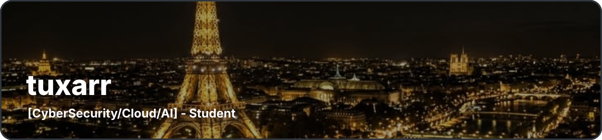

 

<table width="100%">
<tr>

<td width="42%" valign="top">

<h2>tuxarr</h2>

<code>sudo pacman -S pronouns</code>

  

<strong>[CyberSecurity/Cloud/AI] - Student</strong>

  

<h3>Skills</h3>

</td>

<td width="58%" valign="top">

  

<table width="100%">
<tr>

<td width="50%" align="center" valign="middle">
  
   
  <strong>Python</strong>
</td>

<td width="50%" align="center" valign="middle">
  
   
  <strong>Rust</strong>
</td>

</tr>

<tr>

<td width="50%" align="center" valign="middle">
   
  
   
  <strong>PostgreSQL</strong>
</td>

<td width="50%" align="center" valign="middle">
   
  
   
  <strong>Linux</strong>
</td>

</tr>
</table>

</td>

</tr>
</table>

 

<h3>Socials</h3>

