<div align="center">



<br><br>


<br><br>


</div>

<br>


<br>

<table width="100%">
<tr>
<td width="50%" valign="top">

## about_me.sh

```bash
name="tuxarr"
pronouns="he/him"
student="HTL St. Pölten"

focus=(
  "CyberSecurity"
  "Cloud Engineering"
  "Artificial Intelligence"
  "DevOps"
)

main_system="Linux"
shell="Bash"
editor="VS Code"
```

</td>
<td width="50%" valign="top">

## currently_learning.log

```text
Python
Rust
TypeScript
PostgreSQL
PyTorch
Kubernetes
Terraform
Git
Linux
Bash
```

</td>
</tr>
</table>

<br>

<div align="center">

## socials


<br><br>

## snake


<br><br>


</div>
